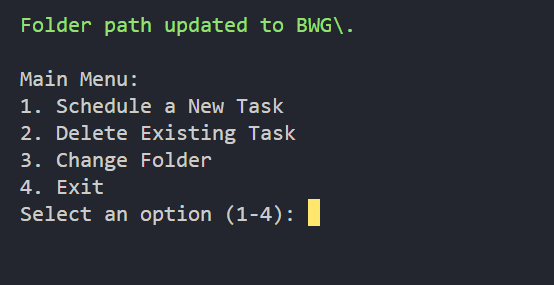
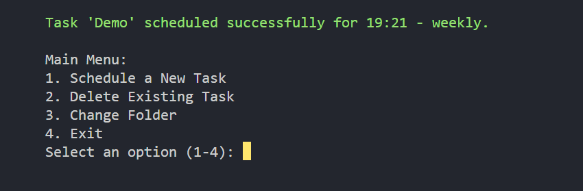
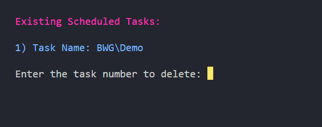

# Task Scheduler Automation

This Python script automates the scheduling, listing, and deletion of tasks in the Windows Task Scheduler. It provides a user-friendly interface to manage PowerShell scripts and their execution times.

## Features

- **Schedule a New Task**: Schedule a PowerShell script to run at a specified time and frequency.
- **Delete Existing Task**: List and delete existing scheduled tasks.
- **Change Folder**: Update the folder path where tasks are stored in the Task Scheduler.

## Prerequisites

- Python 3.x
- Windows operating system (as it uses Windows Task Scheduler)
- PowerShell scripts to schedule

## Getting Started

1. **Clone the Repository**:
    ```sh
    git clone https://github.com/yourusername/task-scheduler-automation.git
    
    cd task-scheduler-automation
    ```

2. **Run the Script**:
    ```sh
    python main.py
    ```

## Usage

When you run the script, you will be presented with a main menu:

```
Main Menu:
1. Schedule a New Task
2. Delete Existing Task
3. Change Folder
4. Exit
```

### 1. Schedule a New Task

- Enter the name for the task.
- Provide the full path of the PowerShell script (must have a `.ps1` extension).
- Specify the frequency (daily, weekly, monthly).
- Enter the time in `HH:MM` format.

### 2. Delete Existing Task

- The script will list all existing tasks.
- Enter the task number you wish to delete.

### 3. Change Folder

- Enter the folder name from the Task Scheduler Application.
- The script will validate and update the folder path.

### 4. Exit

- Exit the program.


## Screenshots

- Main Menu:



- Schedule a New Task:



- Delete Existing Task:




## Configuration

The script stores the folder path in a `config.txt` file. If the file does not exist, the script will prompt you to enter the folder name during the initial setup.
